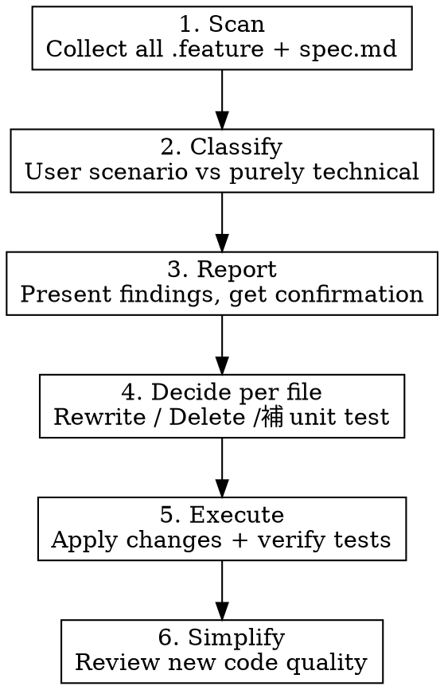

# BDD Hygiene

Audit BDD `.feature` files and OpenSpec `spec.md` for scenarios that test implementation details instead of user-visible behavior. Move technical-only behaviors to unit tests, keeping BDD focused on user scenarios.

## When to Use

- Before releases, to reduce BDD noise
- After noticing feature files that read like unit tests
- When feature count grows and test runs slow down
- When the user asks to review or clean up BDD/specs

## Core Principle

**BDD defines WHAT users do; unit tests verify HOW the code works.**

A feature file is "purely technical" if:
- It only tests internal implementation details (slugify, caching, SQL translation, serialization format)
- Scenarios don't describe something a user would consciously do
- It reads more like a unit test specification than a user story

A feature file has "user scenarios" if:
- Scenarios describe actions a user would perform (create, search, configure, validate)
- Given/When/Then steps use domain language tied to user-visible behavior

## Process

### 1. Scan

Collect all files to audit:
- `core/features/*.feature`
- `cmd/features/*.feature`
- `openspec/specs/*/spec.md`

Use parallel Explore agents for large sets.

### 2. Classify

For each file, determine: **user scenario** or **purely technical**.

Use parallel agents (batch 10-15 files per agent) for efficiency. Each agent reads every scenario and applies the core principle.

### 3. Report

**Only report files that need action** — skip files classified as user scenarios entirely. Present a table of purely-technical (or mixed) files with brief reasons and proposed actions. Do not list files that will be kept as-is. Ask the user to confirm before proceeding.

### 4. Decide

For each purely-technical file, determine the action. Use parallel agents to research each file:

| Condition | Action |
|-----------|--------|
| Has user scenario buried inside | **REWRITE** — extract user scenario, merge into related feature |
| Already covered by unit test | **DELETE** — remove feature + BDD step file + init call |
| No unit test coverage | **SUPPLEMENT THEN DELETE** — write unit tests first, then delete |
| OpenSpec spec fully covered by features + unit tests | **ARCHIVE** — remove the spec |

When checking unit test coverage, search for the key function names and concepts in `*_test.go` files within the same package.

### 5. Execute

Process in order:

1. **Delete** files with existing unit test coverage — remove `.feature`, `bdd_steps_*_test.go`, and `init*Steps` calls from `bdd_test.go`
2. **Supplement** — write unit tests using existing helpers (`setupTestVault`, `mustWriteTypeSchema`, etc.), then delete the feature + steps
3. **Rewrite** — rewrite scenarios to user perspective or merge into related features
4. **Archive** — remove OpenSpec specs whose behavior is fully covered

After each batch, run `go vet` to catch compilation errors from dangling references.

### 6. Simplify

Run `/simplify` on all changed files to catch:
- Duplicate helpers (new vs existing)
- Ignored errors in test code
- Boilerplate that should be extracted into helpers
- Unnecessary code

Final verification: `make test` must pass with zero warnings.

## Cleanup Checklist

When deleting a BDD feature, ensure ALL artifacts are removed:

- [ ] `.feature` file
- [ ] Corresponding `bdd_steps_*_test.go` file
- [ ] `init*Steps(ctx, dc)` call in `bdd_test.go` or equivalent initializer
- [ ] Any context structs only used by deleted steps (e.g., `frontmatterContext`)
- [ ] Unused imports in `bdd_test.go`

**Watch for shared steps** — if a step file provides steps used by OTHER remaining features, keep it. Check with `grep` before deleting.

## Common Mistakes

- Deleting a step file that provides steps shared with other features (causes compilation error)
- Forgetting to remove the `init*Steps` call (leaves dead code)
- Writing new test helpers that duplicate existing ones (check `*_test.go` for `must*`, `setup*`, `write*` helpers first)
- Not checking errors in new test code (`NewObject`, `os.MkdirAll`, `os.WriteFile` return values)
