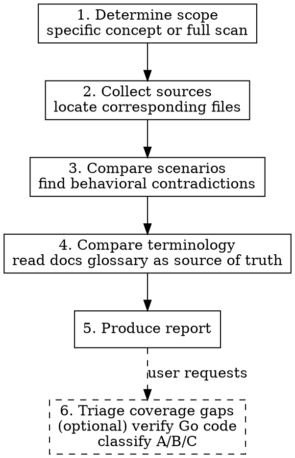

# Consistency Check

Cross-reference BDD feature files (`.feature`), OpenSpec specifications (`spec.md`), and documentation (docs) to surface scenario contradictions and terminology inconsistencies. Optionally triage coverage gaps by verifying Go source code to classify them as implemented-but-untested, not-implemented, or implemented-differently.

## Why This Skill Exists

typemd's behavior is defined across three sources with different purposes:

- **BDD feature files** (`core/features/*.feature`) — Executable behavior specs in Gherkin syntax. Evidence of what the code actually does.
- **OpenSpec specs** (`openspec/specs/*/spec.md`) — Requirements in RFC 2119 language (SHALL/MUST/MAY). The authoritative source for what features should do.
- **Documentation** (`websites/docs/src/content/docs/`) — User-facing explanations. What users are told features do. The docs are assumed to be correct — they are the source of truth for terminology and user-facing descriptions.

These should stay aligned, but drift happens as development iterates: OpenSpec adds a requirement without a BDD scenario, docs describe behavior differently from tests, or the same concept gets different names in different places.

The goal is to **systematically surface contradictions**, not fix them — the user decides what to do next.

## Usage

The user can specify scope or default to a full scan:

- Scoped: "Check consistency for relations" → only compare relation-related files
- Full scan: No scope specified, or "do a full consistency check" → scan all concept areas

**Default behavior: if the user does not specify a scope, perform a full scan.**

## Process



### 1. Determine Scope

Identify which concept areas to check. Use this mapping to locate corresponding files across the three sources:

| Concept Area | BDD feature files | OpenSpec specs | Docs |
|-------------|-------------------|----------------|------|
| Object lifecycle | `object.feature` | — | `concepts/objects.md` |
| Relation | `relation.feature` | `object-relations/spec.md` | `concepts/relations.md` |
| System Properties | `system_property.feature` | `system-properties/spec.md`, `system-property-registry/spec.md` | `basics/properties.md` |
| Type Schema | `type_crud.feature` | `type-schema/spec.md` | `concepts/types.md` |
| Name Property | `name_property.feature` | `name-property/spec.md` | `basics/properties.md` (partial) |
| Name Template | `name_template.feature` | `name-template/spec.md` | `basics/templates.md` |
| Unique Constraint | `unique_constraint.feature` | `unique-constraint/spec.md` | `basics/validation.md` (partial) |
| Links | `wikilink.feature` | `wiki-links/spec.md` | `concepts/links.md` |
| Shared Properties | `shared_properties.feature` | `shared-properties/spec.md` | `basics/properties.md` (partial) |
| Tags | `tag_type.feature`, `tag_resolution.feature`, `tag_uniqueness.feature` | — (see changes/) | `basics/tags.md` |
| Object Templates | `object_template.feature` | — (see changes/) | `basics/templates.md` (partial) |
| Query / Search | `query.feature` | — | `basics/queries.md`, `basics/search.md` |

If the user says "all", scan each area. If the user names an area not in the table, use Glob and Grep to find related files.

### 2. Collect Sources

For each concept area, read the content from all three sources. File paths:

- BDD: `core/features/<name>.feature`
- OpenSpec: `openspec/specs/<name>/spec.md`
- Docs (en): `websites/docs/src/content/docs/` under `concepts/`, `basics/`, `advanced/`, `cli/`, or `tui/`
- Docs (zh-tw): same structure under `zh-tw/`

Use an Explore agent to read multiple areas in parallel when doing a full scan.

### 3. Compare Scenarios

This step finds **behavioral contradictions**. For each concept area, systematically compare:

#### 3a. OpenSpec → BDD Coverage

Every OpenSpec Requirement and Scenario should have a corresponding BDD scenario.

How to check:
- Extract all `### Requirement:` and `#### Scenario:` blocks from the OpenSpec spec.md
- Look for semantically matching `Scenario:` or `Scenario Outline:` in the corresponding BDD feature file
- Record OpenSpec requirements that lack BDD coverage

Names don't need to match exactly — semantic correspondence is what matters. For example, OpenSpec says "Relation property with `multiple: true` allows appending" and BDD has "Scenario: Append to multiple-value relation".

#### 3b. BDD → OpenSpec Traceability

Reverse check: does BDD contain behaviors not recorded in OpenSpec?

- BDD scenarios whose behavior has no matching OpenSpec requirement
- This may indicate: feature was implemented before spec was written, or it's an edge-case test that doesn't need a spec

#### 3c. Docs → Behavioral Accuracy

Do documentation descriptions match BDD/OpenSpec?

- Docs claim X can do something, but neither BDD nor OpenSpec confirms it
- Docs describe behavior that contradicts BDD test assertions
- Docs omit important behavior defined in BDD/OpenSpec

#### 3d. CLAUDE.md → Actual State

Does the Data Model and Architecture section in `CLAUDE.md` match the other three sources?

### 4. Compare Terminology

This step finds **naming inconsistencies**. The same concept should use the same term everywhere.

#### Source of Truth

Read the docs glossary page (`concepts/glossary.md` and `zh-tw/concepts/glossary.md`) as the canonical terminology reference. The glossary defines:
- The English term for each concept
- The zh-tw translation (in parentheses after the heading, e.g. "Object（物件）")
- The canonical definition

Use the glossary to check whether BDD, OpenSpec, and other docs pages use consistent terminology.

#### Dimensions to Check

| Dimension | Description | Example |
|-----------|-------------|---------|
| **zh-tw / en alignment** | Same concept translated consistently per glossary | "relation" → always "關聯", not sometimes "連結" |
| **Verb usage** | Same operation uses same verb | create vs add vs new; link vs connect vs relate |
| **Noun capitalization** | Concept names consistently capitalized | Object vs object; Type vs type |
| **Compound words** | Hyphenation/spacing consistent | link vs wiki-link vs wikilink |
| **Property terminology** | property/field/attribute consistent | property vs field vs column |
| **Value descriptions** | Boolean/enum values described consistently | `multiple: true` vs "multi-value" vs "allows multiple" |

### 5. Produce Report

The report has two sections matching the two comparison dimensions.

#### Report Format

```markdown
# Consistency Check Report

Scope: [list of concept areas checked]
Date: [date]

## Scenario Contradictions

### [Concept Area Name]

| Category | Source A | Source B | Finding |
|----------|----------|----------|---------|
| CODE | Docs: relations.md | BDD: relation.feature | Docs say you can Y, but BDD asserts result is Z — code behavior may need to change |
| BDD | OpenSpec: object-relations/spec.md #Req3 | BDD: relation.feature | OpenSpec requires X but BDD has no corresponding scenario |
| TEXT | BDD: relation.feature Scenario: ... | OpenSpec | BDD tests behavior not recorded in OpenSpec — update spec to match |

### [Next Concept Area]
...

## Terminology Inconsistencies

| Concept | Location A | Term A | Location B | Term B | Suggestion |
|---------|-----------|--------|-----------|--------|------------|
| Relation | basics/properties.md:L12 | "連結" | concepts/glossary.md | "關聯" | Unify to "關聯" per glossary |
```

#### Action Categories

Classify each finding by what it takes to fix, not by how "severe" it sounds:

| Category | Definition | Cost |
|----------|------------|------|
| **TEXT** | Spec text error, docs missing content, terminology inconsistency, translation gap | Low — edit files |
| **BDD** | OpenSpec requirement without corresponding BDD scenario (behavior may or may not be implemented) | Medium — write test + step definitions |
| **CODE** | Two sources describe the same behavior in conflicting ways, implying code may need to change | High — investigate, possibly change program behavior |

### 5a. Decide Next Action

After presenting the report, summarize the counts by category and ask the user:

1. **TEXT + BDD items** — "Want to fix these now?" These are safe to fix immediately: text edits have near-zero risk, and adding BDD scenarios doesn't change program behavior.
2. **CODE items** — "Want to create issues for these?" These require investigation into what the code actually does, and may need behavior changes. Better tracked as issues.

If the user wants to fix TEXT items now, use parallel agents to edit spec/docs files directly.

If the user wants to address BDD items, proceed to Step 6 (triage) first to determine whether each gap is "implemented but untested" (write BDD) or "not implemented" (reclassify as CODE → create issue).

### 6. Triage Coverage Gaps (optional)

When the report contains BDD category items (OpenSpec requirements without BDD scenarios), the user may ask to triage them. This step verifies whether the Go code actually implements each requirement, because a missing BDD scenario doesn't necessarily mean a missing feature.

#### Why triage matters

A coverage gap has three possible realities:

| Classification | Meaning | Action |
|---------------|---------|--------|
| **A — Implemented, untested** | Code implements the behavior but no BDD scenario covers it | Write BDD scenario to lock down existing behavior |
| **B — Not implemented** | Code does not implement this requirement at all | Decide: implement the feature, or update/remove the OpenSpec requirement |
| **C — Implemented differently** | Code exists but behaves differently from what OpenSpec says | This is the highest risk — investigate and fix either the code or the spec |

#### How to triage

For each BDD coverage gap from the report:

1. **Read the Go source code** that handles the relevant behavior. Use Grep to find the function or method mentioned in the OpenSpec requirement (e.g., `LinkObjects`, `UnlinkObjects`, `SyncWikiLinks`).
2. **Trace the code path** described in the OpenSpec scenario. Does the code handle this case? What does it return?
3. **Classify as A, B, or C** based on what the code actually does.

Use parallel Explore agents to triage multiple concept areas simultaneously.

#### Triage report format

Append the triage results to the consistency check report:

```markdown
## Coverage Gap Triage

### [Concept Area Name]

| OpenSpec Requirement | Classification | Evidence | Action |
|---------------------|---------------|----------|--------|
| "Duplicate link is rejected" | A — Implemented | `object_service.go:L142` returns `ErrDuplicateLink` | Write BDD scenario |
| "Unlink one from multiple-value" | B — Not implemented | `object_service.go` UnlinkObjects only clears the entire property | Create issue or update spec |
| "Reverse relations displayed" | C — Different behavior | Code uses `→` but spec says `←` for reverse | Investigate: fix code or spec |
```

#### Recommended priority

Triage in this order (highest risk first):

1. **CODE items** from the report — these are known contradictions, verify the code behavior
2. **Relation gaps** — error handling paths are most likely to have A/B/C mix
3. **Link gaps** — deduplication and cleanup are often edge cases that may not be implemented
4. **Other BDD gaps** — remaining items

## Important Notes

- Steps 1–5 produce a read-only report. Step 6 (triage) is optional and also read-only — it classifies gaps but does not modify files. The user decides follow-up actions.
- **Docs are the source of truth for terminology.** The glossary page (`concepts/glossary.md`) defines canonical terms. When other sources use different terms, they should align to the glossary.
- OpenSpec is the authoritative source for requirements. When OpenSpec conflicts with BDD, usually BDD needs updating — but OpenSpec could also be outdated. The report should mention both possibilities.
- BDD scenario names don't need to exactly match OpenSpec requirement names. Semantic correspondence is what matters.
- Both en and zh-tw docs should be checked. Translation consistency between en/zh-tw is also in scope.
- If a concept area only has two sources (e.g., has BDD but no OpenSpec), compare the available two and note the missing third source.
