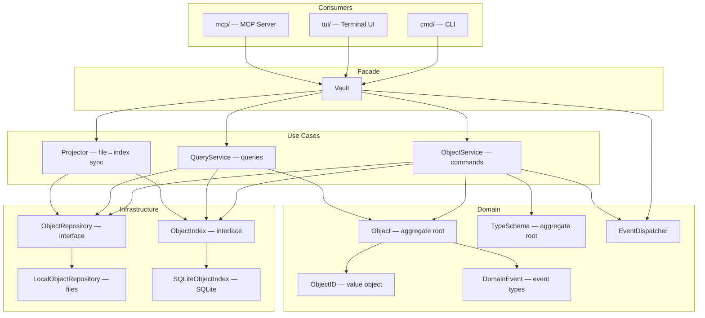
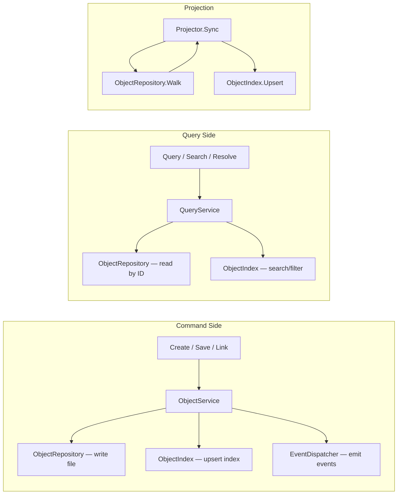

# CLAUDE.md

## Project Overview

typemd is a local-first CLI knowledge management tool. Objects (books, people, ideas) are stored as Markdown files with YAML frontmatter, connected by Relations. SQLite provides indexing.

## Architecture

- **core/** — Core library: objects, types, relations, index
- **cmd/** — CLI commands (Cobra)
- **tui/** — Terminal UI (Bubble Tea)
  - **tui/widget/** — Shared UI primitives (CenteredPopup, OverlayPopup via Layer/Compositor, scroll) used across TUI components
- **mcp/** — MCP server
- **web/** — Web UI: React + shadcn/ui (future)
- **app/** — Desktop app via Wails + shared React frontend (future)
- **websites/** — Non-Go websites (site, docs, blog)
- **marketplace/** — Claude Marketplace plugins (future)

## Core Package Architecture

The `core/` package follows **Clean Architecture** with **CQRS** (Command Query Responsibility Segregation). The design separates concerns into layers with clear dependency rules.

### Layer Diagram



### CQRS Flow



### Key Design Decisions

- **ObjectRepository** returns domain entities (`*Object`, `*TypeSchema`), not raw bytes. Path conventions and serialization are encapsulated in implementations.
- **ObjectIndex** returns `ObjectResult` (lightweight projection) for search results. Full entity retrieval goes through `ObjectRepository.Get(id)`.
- **Vault** is a thin facade / DI container. Object business logic lives in `ObjectService` (commands) and `QueryService` (queries). Type schema CRUD (`SaveType`, `DeleteType`, `CountObjectsByType`) lives directly on Vault since it delegates to `ObjectRepository` without needing a separate service layer.
- **Domain Events** follow "entity produces → use case dispatches" pattern. Entity methods return `DomainEvent`; services collect and dispatch after successful operations.
- **Files are the source of truth**. SQLite index is an acceleration layer maintained by the `Projector`.

### Key Files

| File | Role |
|------|------|
| `display.go` | DisplayProperty struct + FormatValue/Format rendering + Vault.BuildDisplayProperties facade |
| `doctor.go` | Doctor health check: RunDoctor orchestrator, DoctorReport, issue categories |
| `doctor_orphan.go` | OrphanDir scanning for objects/ and templates/ without type schemas |
| `domain_event.go` | Domain event types + EventDispatcher |
| `filter_operator.go` | Type-aware filter operator registry (validOperators) + FilterRuleToSQL translation + ValidateFilterOperator + OperatorsForType |
| `list.go` | Vault.ListTypes() facade for listing all available type names |
| `local_object_repository.go` | LocalObjectRepository (struct, path conventions, object CRUD, shared properties) |
| `local_object_repository_schema.go` | Type schema CRUD and migration |
| `local_object_repository_template.go` | Template CRUD |
| `migrate.go` | MigrateObjects (add/remove/rename properties) + MigrateSchemas (enum→select conversion) |
| `name_template.go` | EvaluateNameTemplate for `{{ date:FORMAT }}` placeholder expansion in name templates |
| `object.go` | Object entity (aggregate root) + Vault facade methods |
| `object_id.go` | ObjectID value object |
| `object_index.go` | ObjectIndex interface + ObjectResult + SortRule |
| `object_repository.go` | ObjectRepository interface |
| `object_service.go` | ObjectService (command use cases) |
| `projector.go` | Projector (file→index sync): full Sync + incremental SyncFiles (path-based) + objectPathToID helper |
| `query.go` | Vault query facades (QueryObjects/SearchObjects/VaultStats/TypeStats/RebuildIndex) + ObjectResult→Object converters |
| `query_service.go` | QueryService (query use cases) |
| `relation.go` | Relation struct + Vault.LinkObjects/UnlinkObjects facades + relation property helpers (append/remove) |
| `shared_properties.go` | Vault.LoadSharedProperties + SharedPropertiesMap + ValidateSharedProperties + resolveUseEntries |
| `slugify.go` | Slugify() function for converting natural-language names to valid slugs |
| `sqlite_object_index.go` | SQLiteObjectIndex (SQLite queries) |
| `starters.go` | Embedded starter type templates (idea/note/book) + StarterTypes() + Vault.WriteStarterTypes() |
| `stats.go` | VaultStats/TypeSummary/TypeStats/PropertyStats structs + QueryService.VaultStats()/TypeStats() methods + TypeSummary.DisplayName() |
| `sync.go` | SyncResult/OrphanedRelation structs + Vault.SyncIndex() facade for Projector.Sync + Vault.SyncFiles() for incremental sync |
| `system_property.go` | SystemProperty registry (name/description/created_at/updated_at/tags) + IsSystemProperty/IsImmutableSystemProperty helpers |
| `tag.go` | resolveTagReference helper for tag name-to-ID resolution during sync |
| `template.go` | Template entity + Vault facade methods (ListTemplates/LoadTemplate/SaveTemplate/DeleteTemplate) |
| `type_schema.go` | TypeSchema entity + helpers + Vault type CRUD (SaveType/DeleteType/CountObjectsByType) + LoadType with schema cache + InvalidateSchemaCache |
| `type_schema_marshal.go` | YAML serialization (MarshalTypeSchema) + version handling (CompareVersions) + color validation (ValidColorPresets) |
| `type_schema_validate.go` | Schema validation (ValidateSchema) + object validation (ValidateObject) + property type validators |
| `ulid.go` | GenerateULID + StripULID + ulidSuffixPattern for ULID generation and stripping |
| `validate.go` | Vault-wide validators: ValidateAllObjects, ValidateRelations, ValidateWikiLinks, ValidateNameUniqueness, ValidateAllSchemas |
| `vault.go` | Vault facade + lifecycle (Open/Close/Init) |
| `vault_config.go` | VaultConfig struct (CLIConfig + TUIConfig) + YAML loading + WriteConfig + DefaultType() + Config() + GetConfigValue/SetConfigValue/ConfigKeys (key registry) |
| `view.go` | ViewConfig/FilterRule/GroupRule structs + ViewLayout constants + custom UnmarshalYAML (legacy string→[]GroupRule migration) + Vault view CRUD (ListViews/LoadView/SaveView/DeleteView/DefaultView) |
| `wikilink.go` | WikiLink/StoredWikiLink structs + ParseWikiLinks + RenderWikiLinks + Vault.ListWikiLinks/ListBacklinks facades |

### TUI Architecture

The TUI uses a three-panel layout (sidebar, body, properties) with a **right panel mode** system:

- `panelEmpty` — no content selected
- `panelObject` — object detail view (body + properties)
- `panelTypeEditor` — type schema editor (independent sub-model `typeEditor` split across `tui/type_editor.go`, `type_editor_update.go`, `type_editor_render.go`, `type_editor_wizard.go`, `type_editor_prop_detail.go`)
- `panelTemplate` — template detail view (independent sub-model `templateEditor` in `tui/template_editor.go`)
- `panelView` — full-width view mode (independent sub-model `viewMode` in `tui/view_mode.go`) with optional `viewEditor` sub-model (`tui/view_editor.go`) shown as a right split panel

The right panel automatically follows the sidebar cursor: moving to an object shows its detail, moving to a type header shows the type editor. The `typeEditor` sub-model has its own `Update()`/`View()` methods and internal mode state (view, edit, move, add wizard, delete confirmation, property detail popup). The type editor includes a Templates section listing available templates; pressing Enter on a template transitions to `panelTemplate` mode. The `templateEditor` sub-model supports viewing, inline editing (body + properties), creating, and deleting templates. The type editor also includes a Views section listing saved views; pressing Enter on a view or pressing `v` from the sidebar transitions to `panelView` mode — a full-width list that replaces the three-panel layout. Navigation stack: sidebar → view list (Enter opens object) → object detail (Esc returns to view list) → Esc exits view mode. Pressing `e` in view mode opens the `viewEditor` as a right split panel (60/40 split, mutually exclusive with preview). The view editor supports inline editing of filter rules, sort rules, and group rules with property picker (text + list), operator picker (scrollable list), and auto-save on every change.

The TUI file watcher monitors both `objects/` (for object changes) and `.typemd/types/` (for schema changes). Object file changes trigger incremental index sync via `Projector.SyncFiles()`. Schema file changes trigger `InvalidateSchemaCache()` followed by a full refresh. The watcher debounce interval defaults to 200ms and is configurable via `tui.debounce_ms` in `.typemd/config.yaml`.

Type creation uses a **title panel wizard** (`createTypeState` in `tui/create_type.go`): triggered via `+ New Type`, it transforms the title panel into a multi-field form (emoji, name, plural) with Tab cycling and a live type schema preview in the right panel. After creation, the type editor opens automatically.

## Data Model

- Objects identified by `type/<slug>-<ulid>` (e.g. `book/golang-in-action-01jqr3k5mpbvn8e0f2g7h9txyz`)
- All objects have system properties managed by typemd: `name` (preserves original input on creation; auto-populated from slug for pre-slugified names, or from name template if defined), `description` (optional, user-authored), `created_at` (set on creation, immutable), `updated_at` (updated on save, immutable), `tags` (relation to built-in `tag` type, multiple). These appear first in frontmatter in that order. System properties are either **user-authored** (`name`, `description`, `tags` — can be overridden by templates) or **auto-managed** (`created_at`, `updated_at` — cannot be overridden).
- Type schemas: `.typemd/types/<name>/schema.yaml` (directory format) or `.typemd/types/<name>.yaml` (legacy single-file, auto-migrated to directory on load). Cannot define properties named `description`, `created_at`, `updated_at`, or `tags` — they're reserved system properties; `name` can appear in `properties` with only a `template` field for auto-generated names. Type schemas support optional `plural` (for display in collection contexts), `unique` (to enforce name uniqueness), `version` (semver-style `"major.minor"` string for schema migration tracking, default `"0.0"`), `color` (preset name or `#RGB`/`#RRGGBB` hex for visual theming), and `description` (free-text type documentation) fields. Properties also support an optional `description` field for documenting their purpose.
- Views: `.typemd/types/<name>/views/<view>.yaml` (optional, defines layout + columns + filter + sort + group_by for presenting objects of a type). Two layouts: `list` (name + optional inline values) and `table` (columnar NAME + property columns with headers). Optional `columns` field (`[]string`) specifies which properties to display; defaults: list = none (name only), table = all properties. `group_by` is `[]GroupRule` (array of `{property: string}`) supporting multi-level grouping; legacy single-string format (`group_by: "genre"`) is auto-migrated on load. Each type has an implicit default view (list layout, sort by name asc) that materializes as `views/default.yaml` when customized. ViewConfig is in core; layout rendering is in TUI.
- Built-in types: `tag` (🏷️, plural "tags", unique, backs `tags` system property, has `color` and `icon` string properties) and `page` (📄, plural "pages", general-purpose content container). Built-in types exist without YAML files, cannot be deleted, but can be overridden by custom `.typemd/types/<name>/schema.yaml`.
- Shared properties: `.typemd/properties.yaml` (optional, defines reusable property definitions referenced via `use` in type schemas; `use` entries can override `pin`, `emoji`, and `description`)
- Relations defined as properties in type schemas
- Wiki-links: `[[type/name-ulid]]` syntax in markdown body, with backlink tracking
- SQLite index: `.typemd/index.db`
- TUI session state: `.typemd/tui-state.yaml` (persisted on quit, restored on launch; stores `selected_object_id` or `selected_type_name`, expanded groups, scroll offset, panel widths, props visibility, and optionally view mode state — `view_type_name`, `view_name`, `view_cursor`, `view_scroll`, `view_expanded_groups` — when the TUI was in view mode on exit)
- Vault config: `.typemd/config.yaml` (interface-layer namespacing; `cli.default_type` sets the default type for `tmd object create`; `tmd init` always creates this with `default_type: page`)
- Starter type templates: `core/starters/*.yaml` (embedded in binary via `//go:embed`; offered during `tmd init` as opt-in type schemas — idea, note, book)
- Object templates: `templates/<type>/<name>.md` (optional, Markdown files with frontmatter property overrides and body content applied during `tmd object create`; single template auto-applies, multiple templates prompt for selection or use `-t` flag)
- Object files: `objects/<type>/<name>.md`

## Web UI Architecture

- **Shared frontend**: `tmd serve`, try.typemd.io, and desktop app (Wails) share one React + shadcn/ui frontend
- **Storage Interface**: Frontend talks to a `VaultStorage` abstraction
  - `tmd serve` → Go HTTP API (read-write)
  - try.typemd.io → GitHub REST API from browser, no backend (read-only initially, read-write later)
  - Wails → Go bindings (read-write)
- **No SQLite in browser**: try.typemd.io uses in-memory index built from GitHub API responses
- **Design principle**: SQLite is optional acceleration, not a hard dependency — files are always the source of truth

## Language Convention

**English is the primary language** for all project artifacts:

- **Issues** — titles, descriptions, comments
- **Commits** — commit messages and bodies
- **Skills** — skill content in `.claude/skills/`
- **Releases** — release notes and CHANGELOG

Blog posts are the exception: written in Traditional Chinese (zh-tw) first, then synced to English via the `sync-blog` skill.

## Build & Test

```bash
go build ./...
go test ./...
go run ./cmd/tmd [command]
```

## Testing

This project uses two layers of testing:

- **BDD (Godog)** — Define behaviors, establish shared vocabulary, and describe what a feature does from the user's perspective. Gherkin `.feature` files live in `<package>/features/`. BDD scenarios focus on **what**, not implementation details.
- **Unit tests** — Verify precise logic: edge cases, output formats, exact values, error conditions. Traditional Go `testing` style.

When deciding where a test belongs: if it defines a behavior or names a concept, write a BDD scenario. If it validates an implementation detail (e.g. JSON format, lowercase ULID, flag edge cases), write a unit test.

### BDD scope by package

| Package | Testing approach |
|---------|-----------------|
| `core/` | BDD (`core/features/`) + unit tests |
| `tui/`  | BDD (`tui/features/`, planned) + unit tests |
| `web/`  | BDD (`web/features/`, future) |
| `cmd/`  | BDD (`cmd/features/`) + unit tests |
| `mcp/`  | Unit tests — BDD TBD |
