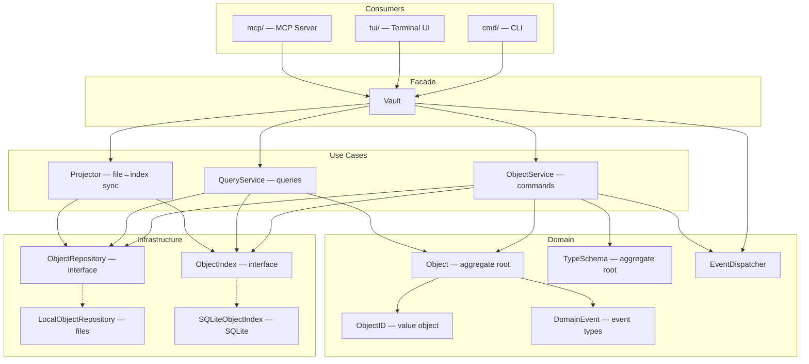

# CLAUDE.md

## Project Overview

typemd is a local-first CLI knowledge management tool. Objects (books, people, ideas) are stored as Markdown files with YAML frontmatter, connected by Relations. SQLite provides indexing.

## Architecture

- **core/** — Core library: objects, types, relations, index
  - **core/ai/** — AI provider abstraction and service layer (Claude CLI integration)
- **cmd/** — CLI commands (Cobra)
- **tui/** — Terminal UI (Bubble Tea)
  - **tui/widget/** — Shared UI primitives (CenteredPopup, OverlayPopup, ToastModel via Layer/Compositor, scroll) used across TUI components
- **mcp/** — MCP server
- **web/** — Web UI: React + shadcn/ui (future)
- **app/** — Desktop app via Wails + shared React frontend (future)
- **websites/** — Non-Go websites (site, docs, blog)
- **marketplace/** — Claude Code marketplace plugins (typemd plugin with vault-guide, instructions-guide, explore, and importer skills)

## Core Package Architecture

The `core/` package follows **Clean Architecture** with **CQRS** (Command Query Responsibility Segregation). The design separates concerns into layers with clear dependency rules.

### Layer Diagram



### Key Design Decisions

- **ObjectRepository** returns domain entities (`*Object`, `*TypeSchema`), not raw bytes. Path conventions and serialization are encapsulated in implementations.
- **ObjectIndex** returns `ObjectResult` (lightweight projection) for search results. Full entity retrieval goes through `ObjectRepository.Get(id)`.
- **Vault** is a thin facade / DI container. Object business logic lives in `ObjectService` (commands) and `QueryService` (queries). Type schema CRUD (`SaveType`, `DeleteType`, `CountObjectsByType`) lives directly on Vault since it delegates to `ObjectRepository` without needing a separate service layer.
- **Domain Events** follow "entity produces → use case dispatches" pattern. Entity methods return `DomainEvent`; services collect and dispatch after successful operations.
- **Files are the source of truth**. SQLite index is an acceleration layer maintained by the `Projector`.

### Key Entry Points

- `vault.go` — Vault facade + lifecycle (Open/Close/Init)
- `object_service.go` — command use cases (create/save/link)
- `query_service.go` — query use cases (search/filter/stats)
- `projector.go` — file→index sync (full + incremental)
- `config.go` — VaultConfig (date formats, CLI/TUI/AI config sections)

### TUI Architecture

The TUI uses a three-panel layout (sidebar, body, properties) with **focus mode** (`.` key) for single full-width body. The right panel follows the sidebar cursor via a **right panel mode** system: `panelObject`, `panelTypeEditor`, `panelTemplate`, `panelView` (full-width table/list), `panelStats`, `panelSchemaExplore`. Keybindings are defined in `tui/keys.go`; see `tui/help.go` for the help popup or the [docs site TUI page](websites/docs/src/content/docs/tui/tui.md) for the full keybinding table.

Key sub-models: `typeEditor` (schema editing + wizard + templates), `viewMode` (table/list views with inline cell editing via `cellEdit`), `propEditor` (inline property editing with type-appropriate widgets), `dateEdit` (segmented input + calendar picker), `widget.ToastModel` (transient notifications). File watcher monitors `objects/` and `.typemd/types/` with debounced incremental sync.

## Data Model

- Objects identified by `type/<slug>-<ulid>` (e.g. `book/golang-in-action-01jqr3k5mpbvn8e0f2g7h9txyz`)
- All objects have system properties managed by typemd: `name` (preserves original input on creation; auto-populated from slug for pre-slugified names, or from name template if defined), `description` (optional, user-authored), `created_at` (set on creation, immutable), `updated_at` (updated on save, immutable), `tags` (relation to built-in `tag` type, multiple), `locked` (boolean, user-authored, prevents editing when true). These appear first in frontmatter in that order. System properties are either **user-authored** (`name`, `description`, `tags`, `locked` — can be overridden by templates) or **auto-managed** (`created_at`, `updated_at` — cannot be overridden).
- Type schemas: `.typemd/types/<name>/schema.yaml`. Reserved system properties (`description`, `created_at`, `updated_at`, `tags`) cannot be redefined; `name` can appear with only a `template` field. Optional schema fields: `plural`, `unique`, `version`, `color`, `description`.
- Views: `.typemd/types/<name>/views/<view>.yaml` (optional). Two layouts: `list` and `table`. Supports `columns`, `filter`, `sort`, `group_by`. Each type has an implicit default view (list, sort by name asc).
- Built-in types: `tag` (🏷️, plural "tags", unique, backs `tags` system property, has `color` and `icon` string properties) and `page` (📄, plural "pages", general-purpose content container). Built-in types exist without YAML files, cannot be deleted, but can be overridden by custom `.typemd/types/<name>/schema.yaml`.
- Shared properties: `.typemd/properties.yaml` (optional, defines reusable property definitions referenced via `use` in type schemas; `use` entries can override `pin`, `emoji`, and `description`)
- Relations defined as properties in type schemas
- Wiki-links: `[[type/name-ulid]]`, `[[type/name]]`, or `[[name]]` syntax in markdown body, with backlink tracking. Shorthand forms are resolved during sync and written back as full IDs.
- SQLite index: `.typemd/index.db`
- TUI session state: `.typemd/tui-state.yaml` (persisted on quit, restored on launch)
- Vault config: `.typemd/config.yaml` — sections: `date_format`/`datetime_format`, `cli.*`, `tui.*` (toast, debounce), `ai.*` (providers, prompts). See `config.go` for full key registry.
- Embedded skills: `core/skills/*/SKILL.md` (via `//go:embed`); vault overrides in `.typemd/instructions/<skill>.md`
- Starter types: `core/starters/*.yaml` (offered during `tmd init`)
- Object templates: `templates/<type>/<name>.md` (applied during `tmd object create`)
- Object files: `objects/<type>/<name>.md`

## Web UI Architecture

- **Shared frontend**: `tmd serve`, try.typemd.io, and desktop app (Wails) share one React + shadcn/ui frontend
- **Storage Interface**: Frontend talks to a `VaultStorage` abstraction
  - `tmd serve` → Go HTTP API (read-write)
  - try.typemd.io → GitHub REST API from browser, no backend (read-only initially, read-write later)
  - Wails → Go bindings (read-write)
- **No SQLite in browser**: try.typemd.io uses in-memory index built from GitHub API responses
- **Design principle**: SQLite is optional acceleration, not a hard dependency — files are always the source of truth

## Language Convention

**English is the primary language** for all project artifacts:

- **Issues** — titles, descriptions, comments
- **Commits** — commit messages and bodies
- **Skills** — skill content in `.claude/skills/`
- **Releases** — release notes and CHANGELOG

Blog posts are the exception: written in Traditional Chinese (zh-tw) first, then synced to English via the `sync-blog` skill.

## Build & Test

```bash
make test
```

## Debugging

- **CLI**: `tmd --debug <command>` enables DEBUG-level JSON logging to stderr. Useful for inspecting sync flow, query execution, and AI provider calls.
- **TUI**: Always writes DEBUG-level JSON logs to `.typemd/logs/{YYYY-MM-DD}.log`. Check this file to diagnose TUI issues (sync, file watcher, property editing) without corrupting terminal output.

## Testing

This project uses two layers of testing:

- **BDD (Godog)** — Define behaviors, establish shared vocabulary, and describe what a feature does from the user's perspective. Gherkin `.feature` files live in `<package>/features/`. BDD scenarios focus on **what**, not implementation details.
- **Unit tests** — Verify precise logic: edge cases, output formats, exact values, error conditions. Traditional Go `testing` style.

When deciding where a test belongs: if it defines a behavior or names a concept, write a BDD scenario. If it validates an implementation detail (e.g. JSON format, lowercase ULID, flag edge cases), write a unit test.

### BDD scope by package

| Package | Testing approach |
|---------|-----------------|
| `core/` | BDD (`core/features/`) + unit tests |
| `tui/`  | BDD (`tui/features/`, planned) + unit tests |
| `web/`  | BDD (`web/features/`, future) |
| `cmd/`  | BDD (`cmd/features/`) + unit tests |
| `mcp/`  | Unit tests — BDD TBD |
