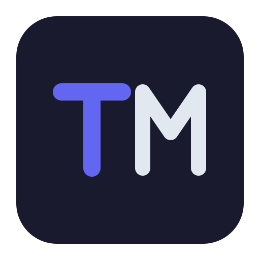

> 🌐 [English](README.md) | [繁體中文](README.zh-TW.md)

<p align="center">
  
</p>

<h1 align="center">TypeMD</h1>

<p align="center">
  一個受 <a href="https://anytype.io">Anytype</a> 和 <a href="https://capacities.io">Capacities</a> 啟發的本地優先 CLI 知識管理工具。
</p>

<p align="center">
  <a href="https://typemd.io">網站</a> · <a href="https://docs.typemd.io">文件</a> · <a href="https://github.com/typemd/typemd">GitHub</a>
</p>

你的知識庫由 **Object（物件）** 組成——而不是檔案。Markdown 只是儲存格式。

## 理念

大多數筆記工具讓你像電腦一樣思考：檔案、資料夾、階層結構。

TypeMD 讓你用 **Object** 來思考——書籍、人物、想法、會議——透過 **Relation（關聯）** 連結。結構源自你的知識，而非資料夾樹狀結構。

## 功能

- **型別化 Object** — 為每種 Type 定義 schema（Book、Person、Idea 等）
- **結構化 Relation** — 用具名的連結連接 Object，支援雙向自動同步
- **Wiki-links 和反向連結** — 在內文中用 `[[type/name-ulid]]` 語法連結 Object，自動追蹤反向連結
- **全文搜尋** — 在你的 vault 中搜尋任何內容
- **結構化查詢** — 依 Type、屬性或 Relation 篩選 Object
- **TUI** — 由 [Bubble Tea](https://github.com/charmbracelet/bubbletea) 驅動的三欄介面，支援檔案變更自動重新整理
- **MCP Server** — 透過 Model Context Protocol 整合 AI 助手
- **本地優先** — 一切都在你的電腦上，以純 Markdown 檔案儲存

## 資料結構

```
vault/
├── .typemd/
│   ├── types/              # 使用者自訂 Type schema（目錄格式）
│   │   ├── book/
│   │   │   └── schema.yaml # 自行建立
│   │   └── person/
│   │       └── schema.yaml
│   ├── properties.yaml     # 共用屬性定義（選用）
│   ├── index.db            # SQLite 索引（自動更新）
│   └── tui-state.yaml      # TUI 會話狀態（自動儲存）
├── templates/              # 物件範本，依 Type 分類（選用）
│   └── book/
│       └── review.md       # 預設 frontmatter 和 body 內容
└── objects/
    ├── book/
    │   └── golang-in-action-01jqr3k5mpbvn8e0f2g7h9txyz.md
    └── person/
        └── alan-donovan-01jqr3k8yznw2a4dbx6t7c9fpq.md
```

Object 以 Markdown 檔案搭配 YAML frontmatter 儲存。`objects/` 底下的每個目錄是一個 **Type 命名空間**——不同 Type 可以共用相同的 slug。

完整的 Object ID 為 `type/<slug>-<ulid>`，例如 `book/golang-in-action-01jqr3k5mpbvn8e0f2g7h9txyz`。CLI 建立物件時會自動附加 [ULID](https://github.com/ulid/spec) 以保證唯一性。

## 安裝

```bash
brew install typemd/tap/typemd-cli
```

或從原始碼安裝：

```bash
go install github.com/typemd/typemd/cmd/tmd@latest
```

也可以從 [GitHub Releases](https://github.com/typemd/typemd/releases) 下載預編譯的執行檔。

## 使用方式

```bash
# 初始化新的 vault
tmd init

# 開啟 TUI
tmd

# 建立 Object（名稱自動轉為 slug，ULID 自動附加）
tmd object create book "Clean Code"
tmd object create "Some Thought"          # 使用 config 中的預設 type

# 搜尋與探索
tmd search "concurrency"
tmd object show book/clean-code           # 支援前綴匹配，不需要完整 ULID
tmd object list

# 連結 Object
tmd relation link book/golang-in-action author person/alan-donovan

# 維護
tmd format                                # 正規化 frontmatter 與 schema 格式
tmd doctor                                # vault 健康檢查
tmd stats                                 # 統計摘要

# 啟動 MCP server 以整合 AI
tmd mcp
```

完整指令參考請見 `tmd --help` 及[文件](https://docs.typemd.io)。

### TUI

```
┌─ Objects ─────────┐  ┌─ Body ─────────────┐  ┌─ Properties ──────┐
│ ▼ book (2)        │  │ # Notes            │  │ title: Go in      │
│   golang-in-action│  │ A great book about │  │   Action          │
│   clean-code      │  │ Go...              │  │ status: reading   │
│ ▶ person (1)      │  │                    │  │ author:           │
│ ▶ note (3)        │  │                    │  │   → person/alan   │
│                   │  │                    │  │                   │
│                   │  │                    │  │                   │
│                   │  │                    │  │                   │
└───────────────────┘  └────────────────────┘  └───────────────────┘
```

在 TUI 中按 `?` 可查看完整快捷鍵說明。

## Type Schema

在 `.typemd/types/` 定義你的 Type（`tag` 和 `page` 是內建型別，其他皆由使用者自訂）：

```yaml
# .typemd/types/book/schema.yaml
name: book
plural: books
emoji: 📚
properties:
  - name: title
    type: string
  - name: author
    type: relation
    target: person
    bidirectional: true
    inverse: books
  - name: status
    type: select
    options:
      - value: to-read
      - value: reading
      - value: done
    default: to-read
  - name: rating
    type: number
```

Relation 定義為 `type: relation` 屬性，使用 `bidirectional` 和 `inverse` 自動同步兩端。完整 schema 參考請見[文件](https://docs.typemd.io)。

## MCP Server

執行 `tmd mcp` 啟動透過 stdio 的 [Model Context Protocol](https://modelcontextprotocol.io) server。AI 客戶端（例如 Claude Code）可以透過以下工具查詢你的 vault：

| 工具 | 說明 |
|------|------|
| `search` | 全文搜尋 Object，回傳 ID、Type 和檔名 |
| `get_object` | 依 ID 取得完整 Object 詳情，包含屬性和內文 |

## 架構

TypeMD 是一個 monorepo，共用 Go 核心程式庫並提供多種介面：

```
typemd/
├── core/       # 核心程式庫——Object、Type、Relation、索引
├── cmd/        # CLI 指令（Cobra）
├── tui/        # 終端 UI（Bubble Tea）
├── mcp/        # MCP server，用於 AI 整合
├── web/        # Web UI（規劃中）
├── site/       # 官方網站（Astro）→ typemd.io
├── docs/       # 文件（Starlight）→ docs.typemd.io
└── app/        # 桌面應用程式（規劃中）
```

所有介面共用相同的 `core` 程式庫。

## 技術堆疊

- **語言**：Go
- **TUI**：[Bubble Tea](https://github.com/charmbracelet/bubbletea) + [Lip Gloss](https://github.com/charmbracelet/lipgloss)
- **MCP**：[mcp-go](https://github.com/mark3labs/mcp-go) — Model Context Protocol server
- **索引**：SQLite 搭配 FTS5 全文搜尋
- **儲存**：Markdown + YAML frontmatter

## 相關資源

- [變更日誌](CHANGELOG.zh-TW.md)
- [貢獻指南](CONTRIBUTING.md)
- [部落格](https://blog.typemd.io)

## 靈感來源

- [Anytype](https://anytype.io) — 加密的本地優先雲端應用替代方案
- [Capacities](https://capacities.io) — 以物件為基礎的知識工作室
